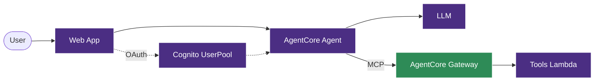

```mermaid
graph LR

    User([User])

    WebApp[Web App]
    Cognito[Cognito UserPool]
    Agent[AgentCore Agent]
    LLM[LLM]
    Gateway[AgentCore Gateway]
    Lambda[Tools Lambda]

    User --> WebApp

    WebApp --> Agent
    WebApp -. OAuth .-> Cognito
    Cognito -.-> Agent

    Agent --> LLM
    Agent -- MCP --> Gateway
    Gateway --> Lambda

    classDef purple fill:#4B2E83,color:#fff,stroke:#fff;
    classDef green fill:#2E8B57,color:#fff,stroke:#fff;

    class WebApp,Cognito,Agent,LLM,Lambda purple;
    class Gateway green;
```